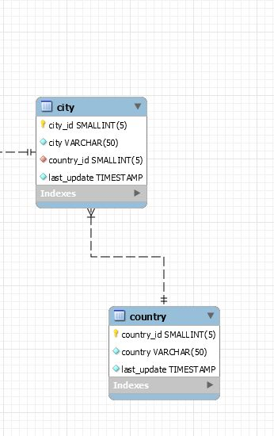

# mysql-backup
This class will backup all the tables (or specific tables) from the database, including the rows.

This backup is aware of dependencies. So let's say the next exercise.



We have two tables, City and Country (and may be more tables).
City depends in Country (Foreign Key FK).

So, if we try to create the table City before the creation of Country then, the operation could fail.

So, the class sorts the tables: First dumps Country then City.


````
$backupClass=new BackupMysql();
echo $backupClass->GenerateDump($host, $user, $password, $schema);
````

#Class Structure

## GenerateDump($host, $user, $password, $schema)     
Generates a dump of the database. 


## field $lockTable = true; (optional) 
Lock all tables before dumping them. The tables are locked with READ.  
## field $dropTable = true; (optional)   
drop a table if exists.  
## field $filterTables = array(); (optional)   
Indicates if we should dump all tables or only specific ones    
## field $insertEvery=500; (optional)   
insert query every "n" number of rows.  
